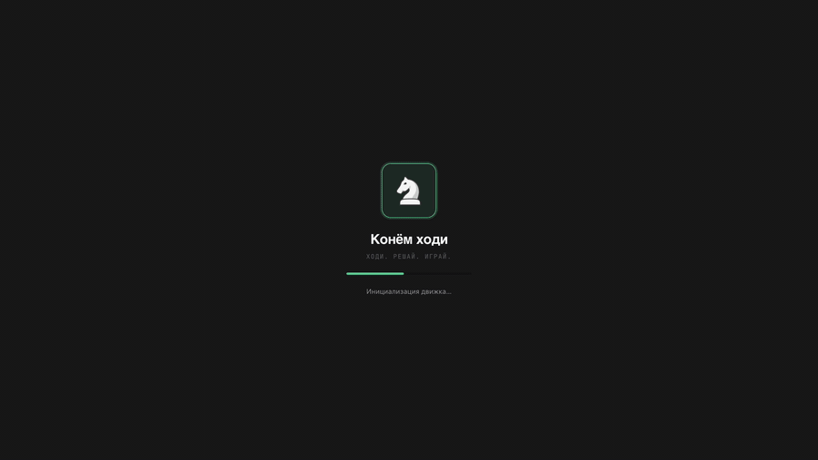
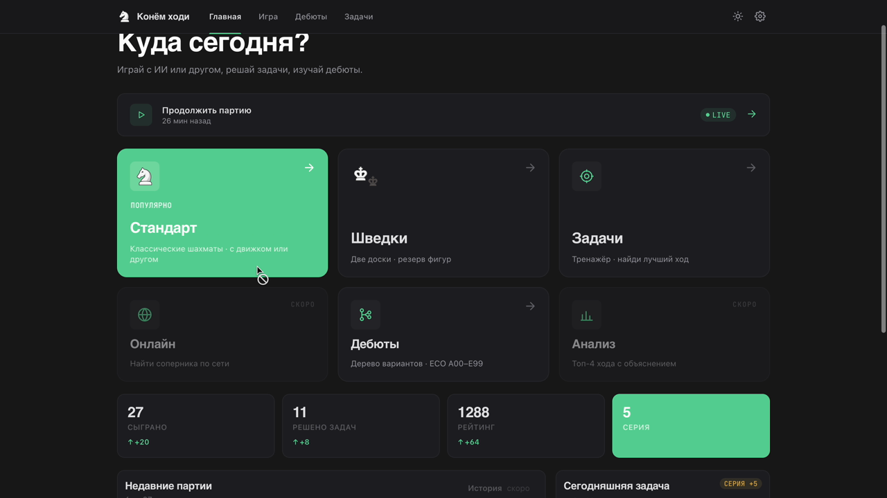
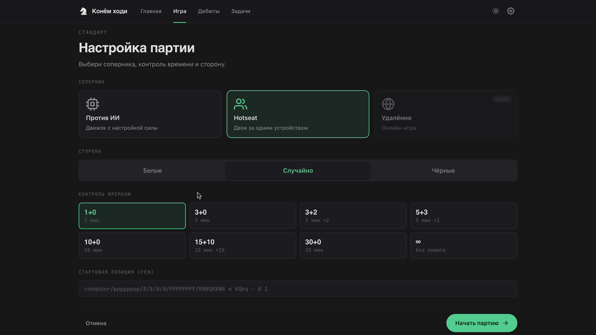
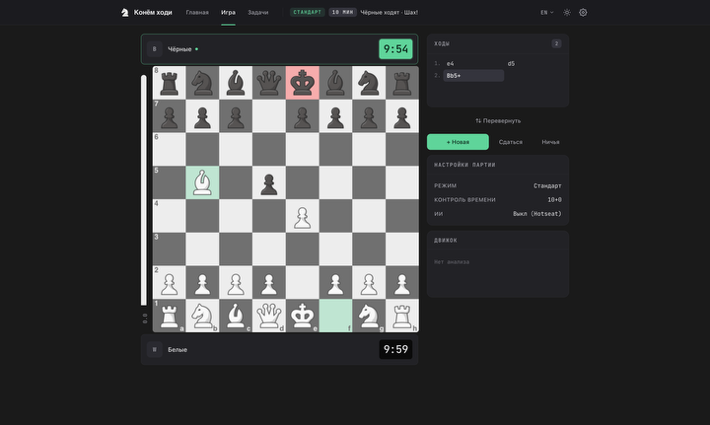
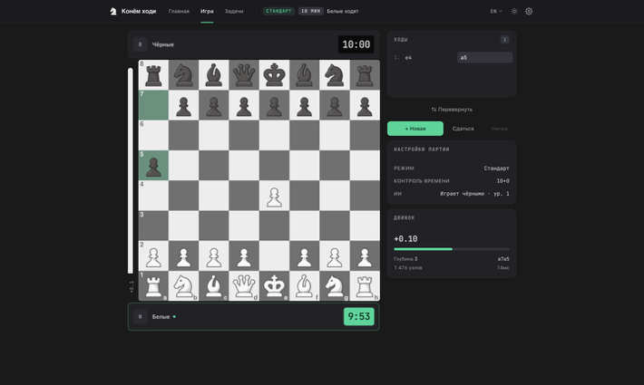
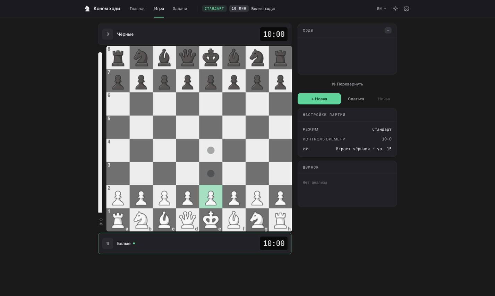

# [Проект: Конём ходи][project-live]

"Конём ходи" - проект образовательной браузерной шахматной системы. Помимо классической
игры поддерживает режим [«Шведки»][rule-bughouse], каталог дебютов на основе
ECO‑классификации, тренажёр задач и собственный модуль «ИИ‑противника» с 20
уровнями сложности.


> Если гифка тормозит - есть короткий [MP4](.github/media/demo.mp4) (~600 КБ).


Живая демка: https://sutuzhko.github.io/chess/

## Скриншоты

|             |                 |  
|----------------------------------------------------------|-----------------------------------------------------------------|  
|           |  |  
|  |                                                                 |  

## Функциональность

В системе реализованы:

- корректная реализация шахматной логики, в том числе специальных правил -
  рокировка, взятие на проходе, превращение пешки - и определение ключевых
  игровых состояний: шах, мат, пат, трёхкратное повторение позиции, правило 50
  ходов;
- режим обучения и задач для тренировки пользователя;
- режим игры с «ИИ‑противником», реализованным как собственный модуль;
- режим игры нескольких пользователей за одним устройством;
- режим «шведки» (две доски, передача захваченных фигур партнёру);
- конструктор FEN‑позиций;
- режимы создания и решения задач;
- автоматическое сохранение текущей партии при закрытии вкладки;
- экспорт и импорт партий в формате PGN;
- динамические настройки приложения с сохранением между сессиями, включая выбор
  цвета отображения, палитры доски и акцентного цвета, поддержка нескольких
  языков (русский, английский, испанский);
- 20 уровней сложности «ИИ‑противника».

Интерфейс спроектирован как интуитивно понятный, без излишних элементов.
Основные элементы: доска с контрастной разметкой светлых и тёмных полей; фигуры
с подсветкой состояний (активная фигура - выделение контуром, возможные ходы -
точки на целевых клетках, последний ход - рамка вокруг исходной и целевой
клеток, шах - подсветка короля); механизмы управления через клики по доске и
кнопки. Также реализованы визуальные подсказки - мигание фигуры при попытке
нелегального хода и всплывающая иконка при объявлении шаха.

Приложение совместимо с разными браузерами (Яндекс, Chrome, Safari, Edge -
последние две версии), операционными системами (Windows, macOS, Android, iOS) и
устройствами (ПК, планшеты, мобильные телефоны).

## Запуск

```bash  
npm install
npm run dev
```  

Прод‑сборка и деплой на GitHub Pages:

```bash  
npm run build
npm run deploy
```  

Команды для разработки:

```bash  
npm run typecheck
npm run lintnpm test
npm run check   # всё сразу + build
```  

## Архитектура

Архитектура системы построена на сочетании предметно‑ориентированной (
Domain‑Driven Design) и событийно‑ориентированной (EDA) разработки.
Распределение ответственности между слоями выполнено в духе MVC, что
соответствует масштабу проекта и условиям ограниченных временных ресурсов.

### Базовая шахматная логика

Ядро приложения - шахматная логика - реализовано в рамках парадигмы
Domain‑Driven Design. Логика игры полностью изолирована от других разделов
приложения, что обеспечивает её детерминированное поведение, тестируемость и
переиспользуемость.

Шахматная логика состоит из ряда сущностей и объектов‑значений (Value Objects).
Все сущности иммутабельны: с каждым ходом создаётся новый снимок доски, при этом
исходный остаётся `readonly` для отката или анализа.

| Сущность / объект‑значение                                        | Описание                                                                |  
|-------------------------------------------------------------------|-------------------------------------------------------------------------|  
| `BoardSnapshot`                                                   | Неизменяемый снимок состояния доски                                     |  
| `Move`, `Square`, `Piece`, `Color`, `PieceType`, `CastlingRights` | Объекты‑значения                                                        |  
| `MoveGenerator`                                                   | Сервис генерации легальных ходов                                        |  
| `GameRules`                                                       | Сервис определения статуса партии                                       |  
| `Match`                                                           | Корневая сущность (Aggregate Root), управляющая жизненным циклом партии |  
| `Timeline`                                                        | Временная линия для функций undo/redo                                   |  

Состояние доски инкапсулировано в классе `BoardSnapshot`. Внутренняя структура -
плоский массив длиной 64, каждый элемент хранит ссылку на объект‑фигуру или
`null`. Координатные объекты `Square` предварительно вычислены и кэшированы.

Кроме расположения фигур снимок хранит возможности рокировки, возможное поле для
взятия на проходе, очередь хода, счётчик полуходов без взятий и продвижений
пешек, номер полного хода. Для совместимости со стандартами шахматного
программирования реализованы функции загрузки и генерации FEN (Forsyth–Edwards
Notation) строк.

Генерация ходов реализована в классе `MoveGenerator` в два этапа: генерация всех
возможных ходов без учёта возможного шаха собственному королю и фильтрация по
признаку нахождения короля не под боем.

Класс `GameRules` определяет статус партии: мат (король под шахом, легальных
ходов нет), пат (король не под шахом, легальных ходов нет), правило 50 ходов,
недостаток материала. Тройное повторение позиции определяется в классе `Match`
через сравнение FEN‑строк.

`Match` управляет последовательностью ходов и публикует события через шину
`InMemoryEventBus`, что позволяет другим частям приложения реагировать на
события на доске, сохраняя изолированность слоёв.

| Событие         | Определение                  |  
|-----------------|------------------------------|  
| `MoveMade`      | Выполнен любой легальный ход |  
| `CheckDeclared` | Противник переведён в шах    |  
| `PawnPromoted`  | Выполнено превращение пешки  |  
| `MatchEnded`    | Партия завершилась           |  
| `UndoMoveMade`  | Выполнен откат хода          |  

### Визуализация

Доска и фигуры - отдельная подсистема, реализованная на нативном HTML5 Canvas 2D
API без использования сторонних графических библиотек. Шахматы как 2D‑игра с
фиксированным размером поля и ограниченным количеством объектов на доске
идеально подходят для процедурной генерации интерфейса через Canvas.

Согласно принципу разделения ответственности графическая подсистема разбита на
три класса:

| Класс             | Ответственность                                                                                                               |  
|-------------------|-------------------------------------------------------------------------------------------------------------------------------|  
| `BoardView`       | Рендерер. Принимает иммутабельное состояние `BoardViewState` и отрисовывает его на Canvas. Не хранит текущее состояние доски. |  
| `BoardController` | Контроллер. Хранит текущее состояние доски, координирует обновления и вызывает перерисовку.                                   |  
| `InputController` | Отслеживание пользовательского ввода. Определяет, по какой клетке кликнул пользователь; совершает ход на второй клик.         |  

Отрисовка полного кадра: очистка холста; вложенный цикл по светлым и тёмным
клеткам; подсветка предыдущего хода; подсветка короля красным при шахе;
`drawImage` для каждой клетки с фигурой; отрисовка координат для крайних полей (
a–h на нижнем ряду, 1–8 в левой колонке); при необходимости - подсказки для
легальных ходов (закрашенный круг - обычный ход, кольцо большого радиуса -
взятие).

Размер клетки определяется как `boardSize / 8`, что обеспечивает масштабирование
при изменении размеров окна.

Цветовая палитра доски не зашита в код, а извлекается из CSS‑переменных
корневого элемента документа. Это позволяет менять палитру через интерфейс
настроек без перекомпиляции.

### Модуль «ИИ‑противника»

Разработка собственного движка обусловлена наличием режимов игры (шведки),
которые не поддерживаются существующими решениями, прозрачностью и объяснимостью
самостоятельно спроектированного решения, возможностью гибкой настройки
сложности игры и отсутствием тяжёлых внешних зависимостей.

| Модуль                | Класс                | Назначение                                                                      |  
|-----------------------|----------------------|---------------------------------------------------------------------------------|  
| Представление позиции | `EnginePosition`     | Хранит расстановку фигур в удобном для расчётов виде                            |  
| Генерация ходов       | `MoveGen`            | Составляет список всех возможных ходов                                          |  
| Хеширование           | `Zobrist`            | Даёт каждой позиции уникальный идентификатор                                    |  
| Поиск хода            | `Search`             | Минимакс с альфа‑бета отсечением, итеративным углублением и упорядочением ходов |  
| Таблица транспозиций  | `TranspositionTable` | Память уже просчитанных позиций                                                 |  
| Оценка позиции        | `Evaluator`          | Определяет, насколько позиция выгодна                                           |  

Основной алгоритм поиска - минимакс с альфа‑бета отсечением. Поиск организован
как итеративное углубление: на каждой итерации увеличивается глубина перебора.
Такая организация позволяет всегда иметь хороший ход в случае, если время на
поиск истекло; лучший ход с прошлого этапа проверяется первым на следующем;
после каждого этапа пользователю показывается текущая оценка и предполагаемая
цепочка ходов.

Расчёт на фиксированную глубину компенсируется просчётом в конце каждой цепочки
всех взятий, пока взять будет нечего. Зависимость отсечения от порядка перебора
ходов минимизируется их сортировкой по перспективности: лучший ход с предыдущего
этапа → взятия (дешёвой фигурой по дорогой) → превращения пешек в ферзя →
остальные.

Для сохранения уже просчитанных позиций каждой из них присваивается уникальный
идентификатор методом Зобрист‑хеширования: каждой комбинации фигура–поле
присваивается `BigInt`, и вся позиция - совокупность присвоенных значений. Это
позволяет не пересчитывать позицию при перемещении одной фигуры - достаточно
изменить в отпечатке только значение для ходившей фигуры. Просчитанные
транспозиции хранятся в отдельной таблице вместе с лучшим ходом, который
используется первым при сортировке.

Функция оценки позиции состоит из двух частей: стоимости фигуры (за основу взята
оценка Шеннона) и её расположения. Для каждого типа фигуры составлена таблица
бонусов и штрафов по полям (PST), учитывающая ключевые шахматные принципы -
например, слоны поощряются за активные диагонали.

Расчёт может занимать до нескольких секунд, поэтому он вынесен в отдельный
фоновый поток браузера (Web Worker). Взаимодействие между основным и фоновым
потоками организовано как обмен структурированными сообщениями.

Пользовательская настройка сложности игры реализована через комбинацию трёх
независимых способов, имитирующих человеческое поведение:

1. **Шум в оценке хода** - случайная поправка, из‑за которой компьютер иногда
   выбирает не самый лучший ход, а чуть слабее. Поправки распределены так, что
   небольшие отклонения случаются часто, а серьёзные - крайне редко.
2. **Температура** - выбор не самого лучшего хода, а одного из нескольких
   хороших с предпочтением сильнейших. Чем ниже сложность, тем более случайный и
   разнообразный выбор.
3. **Зевок** - намеренный выбор с заданной вероятностью внешне разумного, но
   стратегически слабого хода (из списка худших).

Все три метода комбинируются в зависимости от выбранного пользователем готового
уровня сложности.

### Сохранение и загрузка партий

В основе подсистемы - четыре задачи: сохранение текущей партии при закрытии
вкладки или перезагрузке страницы; сохранение списка сыгранных партий для
возврата к ним; экспорт партии в общепринятый формат и обратный импорт;
сохранение точки просмотра.

Организация сохранения основана на приёме Repository: вся система работает с
сохранением через набор команд и не знает, куда именно сохраняются данные. Это
позволяет заменять хранилища без изменения кода - в приложении используется
LocalStorage, в автоматических тестах - временная память. За сохранение отвечает
компонент `LocalStorageMatchRepository`.

Партия восстанавливается по начальной позиции и списку совершённых ходов. Размер
хранимых данных значительно сокращается: снимок доски 80 байт × 60 ходов = 4800
байт против 5 байт × 60 ходов = 300 байт. Каждый ход записывается в формате
UCI (например, `e2e4`); особые ходы (рокировка, взятие на проходе) распознаются
автоматически. При загрузке ходы проигрываются по очереди с проверкой на
легальность, что гарантирует корректность сохранённой партии и защищает
приложение от невалидных файлов.

Каждой партии присваивается уникальный ключ вида `chess.match.<номер>`.
Приставка играет роль ярлыка‑папки, отделяя данные от других ключей в хранилище
браузера.

Приложение также сохраняет и загружает партии в формате PGN (Portable Game
Notation). При импорте PGN из чужого приложения сначала читается описание
партии (данные об игроках и результатах), затем удаляются комментарии, запасные
варианты, специальные значки‑оценки и номера ходов, после чего оставшиеся ходы
переводятся во внутренний формат с проверкой на соответствие правилам.

## Тестирование

Элементы системы покрыты автоматизированными тестами на фреймворке Vitest.

| Файл теста              | Тестируемая функциональность                                                                                                      |  
|-------------------------|-----------------------------------------------------------------------------------------------------------------------------------|  
| `MoveGenerator.test.ts` | Генерация ходов по всем типам фигур, рокировка, en passant, превращения, привязки (pin), валидация PERFT                          |  
| `GameRules.test.ts`     | Шах, мат, пат, недостаточный материал, правило 50 ходов                                                                           |  
| `Match.test.ts`         | Применение ходов, доменные события, undo/redo, завершение партии                                                                  |  
| `BoardSnapshot.test.ts` | FEN‑парсинг и сериализация, корректность расстановки фигур                                                                        |  
| `Timeline.test.ts`      | Навигация по истории ходов, ветвление при откате                                                                                  |  
| `EnginePerft.test.ts`   | PERFT‑валидация: 20/400/8902 хода для глубин 1/2/3 из начальной позиции                                                           |  
| `EngineSearch.test.ts`  | Движок находит очевидно лучший ход в тактических позициях - мат в один ход, мат в два хода, выигрыш фигуры через вилку или связку |  
| `Persistence.test.ts`   | Цикл сохранение → загрузка → сравнение с оригиналом; для внутреннего формата и для PGN                                            |  

## Технологический стек

Vue 3 (Composition API, `<script setup>`), TypeScript в strict, Pinia,
vue‑router, vue‑i18n. Сборка - Vite. Стили - SCSS со scoped‑оформлением.
Шахматный движок и движок шведок исполняются в Web Worker'ах для сохранения
отзывчивости интерфейса.

## Дальнейшее развитие

В долгосрочной перспективе планируется добавить:

- мультиплеер через WebSocket (онлайн‑игра);
- профиль игрока со сбором статистики по партиям и успехам в развитии навыков;
- расширенную базу задач (библиотека FEN‑позиций с категоризацией);
- уроки по мату определёнными фигурами в эндшпиле;
- режим анализа партии.

## Источники и лицензии

- Данные дебютов - [
  `lichess-org/chess-openings`](https://github.com/lichess-org/chess-openings)
  под CC0.
- Live‑статистика
  дебютов - [Lichess Explorer](https://lichess.org/api#tag/Opening-Explorer) (
  публичный API).
- Иконки фигур - классический PNG‑сет в `public/figures/`.

## Доступные скрипты

### `npm run dev`

Запускает приложение в режиме разработки на локальном сервере
http://localhost:5173.

### `npm test`

Исполняет автоматизированные тесты на фреймворке [Vitest][tech-vitest]:
генерация ходов (`MoveGenerator.test.ts`), правила партии
(`GameRules.test.ts`), применение ходов и доменные события (`Match.test.ts`),
сериализация FEN (`BoardSnapshot.test.ts`), история и откат
(`Timeline.test.ts`), PERFT‑валидация движка (`EnginePerft.test.ts`),
тактический поиск (`EngineSearch.test.ts`), цикл сохранение/загрузка
(`Persistence.test.ts`).

### `npm run typecheck`

Проверяет типы во всём проекте через `vue-tsc --noEmit`.

### `npm run lint`

Запускает ESLint и Stylelint с автоисправлением.

### `npm run build`

Генерирует оптимизированную сборку в папке `dist/`.

### `npm run deploy`

Публикует собранное приложение на GitHub Pages.

### `npm run check`

Последовательно прогоняет typecheck → lint → test → build. Используется как
полная проверка перед коммитом.

## Запустить проект

- Клонировать проект - `git clone git@github.com:sutuzhko/chess.git`
- Установить зависимости - `npm install`
- Запустить сервер для разработки - `npm run dev`

&copy; Автор - [Сутужко Богдан][author-github]

[//]: # 'Переменные автора'

[author-github]: https://github.com/sutuzhko

[//]: # 'Переменные приложения'

[project-live]: https://sutuzhko.github.io/chess/

[project-thesis]: https://github.com/sutuzhko/chess

[//]: # 'Переменные источников данных'

[openings-dataset]: https://github.com/lichess-org/chess-openings

[lichess-explorer]: https://lichess.org/api#tag/Opening-Explorer

[rule-bughouse]: https://en.wikipedia.org/wiki/Bughouse_chess

[//]: # 'Переменные используемых технологий'

[tech-vue]: https://vuejs.org/

[tech-ts]: https://www.typescriptlang.org/

[tech-pinia]: https://pinia.vuejs.org/

[tech-vite]: https://vite.dev/

[tech-i18n]: https://vue-i18n.intlify.dev/

[tech-canvas]: https://developer.mozilla.org/en-US/docs/Web/API/Canvas_API

[tech-worker]: https://developer.mozilla.org/en-US/docs/Web/API/Web_Workers_API

[tech-vitest]: https://vitest.dev/
